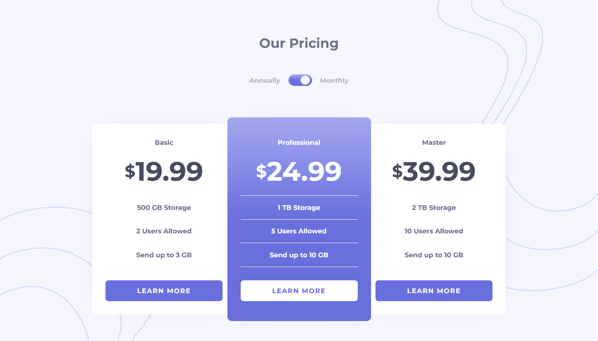

# Frontend Mentor - Pricing component with toggle solution

This is a solution to the [Pricing component with toggle challenge on Frontend Mentor](https://www.frontendmentor.io/challenges/pricing-component-with-toggle-8vPwRMIC). Frontend Mentor challenges help you improve your coding skills by building realistic projects.

## Table of contents

- [Overview](#overview)
  - [The challenge](#the-challenge)
  - [Screenshot](#screenshot)
  - [Links](#links)
- [My process](#my-process)
  - [Built with](#built-with)
  - [What I learned](#what-i-learned)
  - [Continued development](#continued-development)
  - [Useful resources](#useful-resources)
- [Author](#author)
- [Acknowledgments](#acknowledgments)

**Note: Delete this note and update the table of contents based on what sections you keep.**

## Overview

### The challenge

Users should be able to:

- View the optimal layout for the component depending on their device's screen size
- Control the toggle with both their mouse/trackpad and their keyboard
- **Bonus**: Complete the challenge with just HTML and CSS

### Screenshot

### Links

- Solution URL: [Solution](https://www.frontendmentor.io/solutions/pricing-component-with-toggle-doTgvj0p6f)
- Live Site URL: [Site](https://juanmartinrivas.github.io/pricing-component-with-toggle-master/)

## My process

### Built with

- Semantic HTML5 markup
- CSS custom properties
- Flexbox
- Mobile-first workflow
- Parcel
- Sass

### What I learned

The most challenging part of this project was to make the animated toggle button but with the help of[Yaya12085](https://uiverse.io/profile/Yaya12085) I was able to make it.

### Continued development

I plan to fix and rework any mistakes and imperfections that might be found and marked by the community.

### Useful Resources

- [Switch by Yaya12085](https://uiverse.io/Yaya12085/curvy-frog-97): This project from [Uiverse](https://uiverse.io/) helped me build the toggle switch for this project. Thank you very much to [Yaya12085](https://uiverse.io/profile/Yaya12085) for uploading it.

## Author

- Frontend Mentor - [@JuanMartinRivas](https://www.frontendmentor.io/profile/JuanMartinRivas)
- Twitter - [@RivasJuanman](https://twitter.com/RivasJuanman)
- Linkedin - [@Juan Martin Rivas](https://www.linkedin.com/in/juan-mart%C3%ADn-rivas-b3253a1a8/)
- Github - [JuanMartinRivas](https://github.com/JuanMartinRivas)

## Acknowledgments

Once again big thanks to [Yaya12085](https://uiverse.io/profile/Yaya12085) for uploading his [Switch button](https://uiverse.io/Yaya12085/curvy-frog-97) to [Uiverse](https://uiverse.io/). Also big thanks to the people who made [Freecodecamp](https://www.freecodecamp.org) and [The Odin Project](https://www.theodinproject.com), I owe them everything I know about coding. Big thanks to [MDN](https://developer.mozilla.org) and [W3schools](https://www.w3schools.com) as well, for their useful articles on webdev. Finally a big thanks to anyone who helps me improve by giving me feedback on this project.
